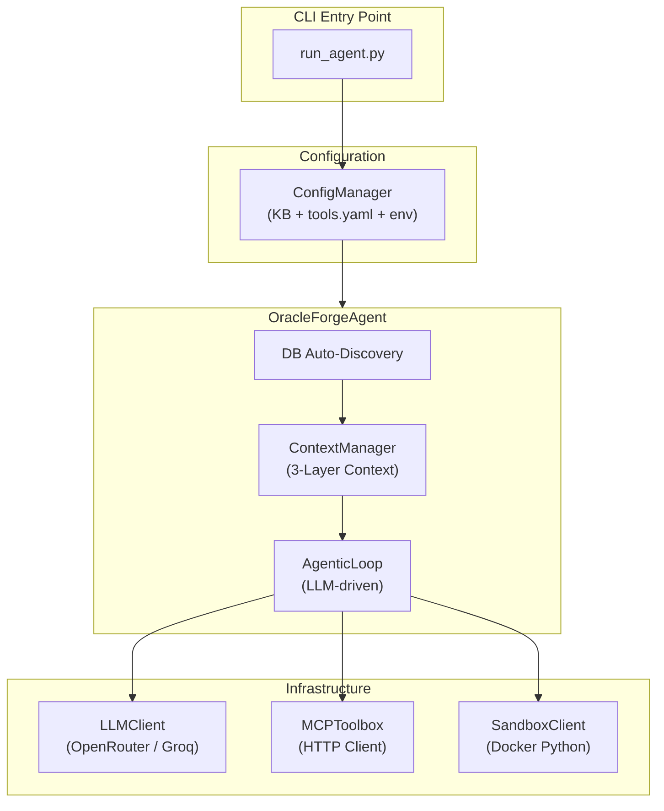
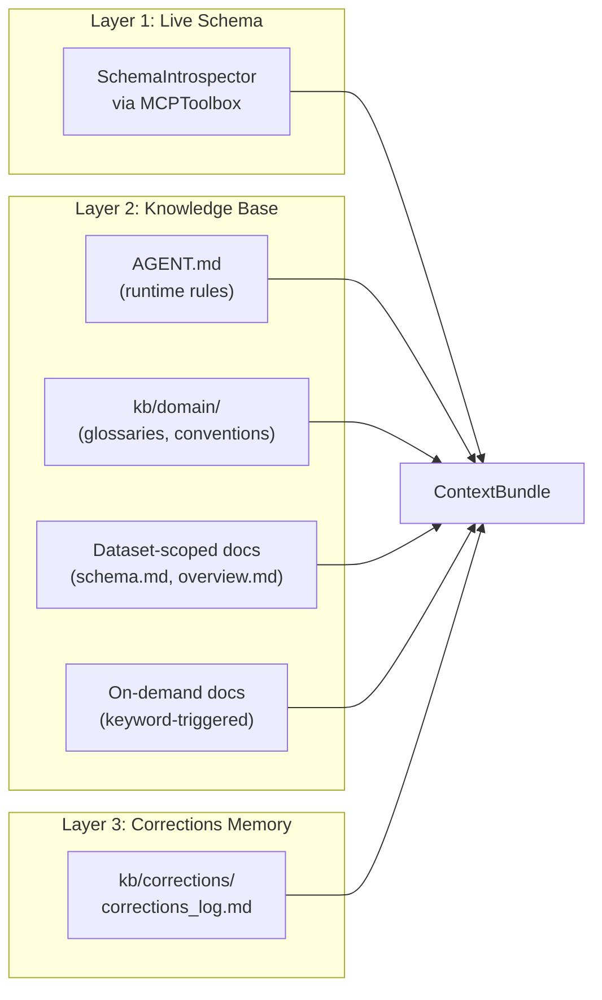

# Oracle Forge

[](https://www.python.org/downloads/)
[](https://github.com/the-data-agent-bench/DataAgentBench)

**Oracle Forge** is a state-of-the-art multi-database data analytics agent, currently ranked **#6 on the global [DataAgentBench (DAB) Leaderboard](https://github.com/ucbepic/DataAgentBench#-leaderboard)**. It empowers LLMs to autonomously reason, query, and synthesize insights across heterogeneous data sources including **PostgreSQL, MongoDB, SQLite, and DuckDB**.

---

## Key Features

- **Autonomous Planning & Routing**: Dynamically decomposes complex natural language queries into executable multi-step plans.
- **Multi-Protocol Connectivity**: Leverages the **Model Context Protocol (MCP)** to interact seamlessly with diverse database engines.
- **Intelligent Self-Correction**: Features a robust repair loop that handles query failures, missing join keys, and data extraction errors autonomously.
- **Traceable Execution**: Generates comprehensive execution logs and traces for full auditability and debugging.
- **Secure Sandbox**: Executes post-retrieval data processing (merge, validation, transformation) in a secure, isolated environment.

---

## Architecture in Detail

Oracle Forge implements a highly modular, multi-tier architecture designed specifically to solve the "context-to-execution" gap in agentic data systems.

### 1. High-Level Orchestration
The agent follows a strict **CLI -> Manager -> Agent -> Loop** pipeline. Configurations are resolved by the `ConfigManager` via institutional knowledge (`kb/`) before the agent is instantiated, ensuring a deterministic setup for every benchmark trial.



### 2. The 3-Layer Context Manager
The `ContextManager` is the brain of the system, injecting three distinct tiers of information into the Agentic Loop for every query:



*   **Layer 1: Live Schema**: Real-time table structures, column types, and relationships (PKs/FKs) introspected via MCP tool calls.
*   **Layer 2: Institutional Knowledge**: Domain-specific terms, join-key glossaries, and SQL conventions parsed from scoped Markdown documentation.
*   **Layer 3: Corrections Memory**: An append-only log of past failure-fix pairs (`kb/corrections/corrections_log.md`). The agent performs a token-overlap search to find and inject relevant "lessons" from previous mistakes proactively.

### 3. AgenticLoop & Tooling
The `AgenticLoop` is an autonomous execution environment where the LLM has access to four core capabilities:


| Tool | Purpose | Backend |
|---|---|---|
| `query_db` | Execute SQL (Postgres, SQLite, DuckDB) or MongoDB pipelines. | MCPToolbox / HTTP |
| `list_db` | Discover available tables and schemas when Layer 1 is incomplete. | MCPToolbox |
| `execute_python` | Perform cross-database joins, complex math, or data cleaning. | Docker Sandbox |
| `return_answer` | Synthesize the final outcome and terminate the loop. | Core Orchestrator |

### 4. Unified Access Layer (MCP)
To maintain strict decoupling, Oracle Forge uses **Model Context Protocol (MCP)** for all database interactions. No direct database drivers are loaded in the agent process. Instead, all requests are routed through the `MCPToolbox` to:
*   **Google MCP Toolbox**: Handling PostgreSQL, MongoDB, and SQLite.
*   **Custom DuckDB Server**: Handling analytical queries on large DuckDB files.

### 5. Proactive Self-Correction
Mistakes are not just handled—they are prevented. Before execution, relevant Layer 3 entries are injected into the system prompt. If a new error occurs (e.g., a missing column), the `AgenticLoop` performs a multi-step diagnosis, updates its internal strategy, and retries the operation without user intervention.


---

## Quick Start

### Prerequisites

- **Python 3.10+** (managed via `uv`)
- **Docker** (for database hosting)
- **Git**

### 1. Installation

```bash
git clone https://github.com/PALM-Oracle-Forge/data-agent-challenge.git
cd data-agent-challenge
pip install uv
uv sync
```

### 2. DAB Benchmark Setup

This project requires the [DataAgentBench (DAB)](https://github.com/ucbepic/DataAgentBench) benchmark datasets. Follow their setup instructions to download and populate the databases first.

Once the DAB datasets are in place, set `DAB_DATASET_ROOT` in your `.env` to the folder containing `query_bookreview/`, `query_googlelocal/`, etc. Then start the containers and all MCP services:

```bash
# Start PostgreSQL and MongoDB (must be pre-populated via DAB setup)
docker run -d --name team-dab-postgres \
  -e POSTGRES_DB=bookreview_db -e POSTGRES_USER=postgres -e POSTGRES_PASSWORD=teampalm \
  -p 5435:5432 postgres:17
docker run -d --name team-dab-mongo -p 27017:27017 mongo:8.0

# Start MCP Toolbox + DuckDB MCP server (reads DAB_DATASET_ROOT from .env)
./setup_dab.sh
```

`setup_dab.sh` mounts the dataset directory into the toolbox container and starts both MCP servers. It will exit with an error if `DAB_DATASET_ROOT` is not set or the path doesn't exist.

### 3. Configure API

```bash
cp .env.example .env
# Edit .env and add your OPENROUTER_API_KEY
```

### 4. Run & Evaluate

```bash
# Run a benchmark query
uv run python run_agent.py --dataset bookreview --query query1 --iteration 30 --root_name run_0

# Score the results
uv run python eval/run_evaluation.py --dataset bookreview --run run_0
```

## Benchmark Performance

Verified results on the [DataAgentBench Leaderboard](https://github.com/ucbepic/DataAgentBench#-leaderboard) as of May 2026.

| Metric | Result |
| :--- | :--- |
| **Leaderboard Rank** | **#6** |
| **Pass@1 (Stratified)** | **46.1%** |
| **Pass@1 (Micro)** | **47.4%** |
| **Trials** | 5 runs per query |

---

## Technology Stack

- **Core Logic**: Python 3.10+, Pydantic
- **Databases**: PostgreSQL, MongoDB, SQLite, DuckDB
- **Communication**: Model Context Protocol (MCP)
- **Deployment**: Docker
- **Execution**: Gemini 3.1 Preview via OpenRouter
---

## The Team

| Name | Role |
| :--- | :--- |
| **Bethel Yohannes** | Driver |
| **Yosef Zewdu** | Driver |
| **Estifanos Teklay** | Intelligence Officer |
| **Melkam Berhane** | Intelligence Officer |
| **Kidus Tewodros** | Signal Corps |
| **Mistire Daniel** | Signal Corps |


---

<p align="center">
  Built for the UC Berkeley DataAgentBench
</p>

